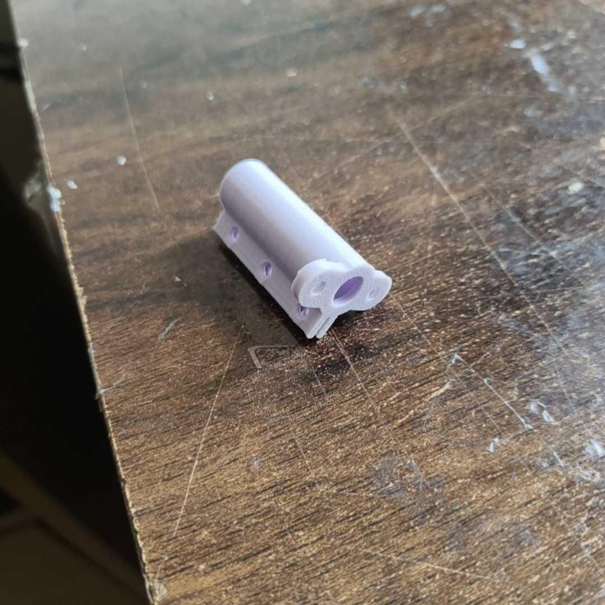

# Epic UAV crash blog

So lets start with what happend
I took the 1m prototype out to fly, which is a reliable platform i can experiment upon, and if it crashes i know nothing will happen
I was doing its first flight with the pixhawk (non autonomous) and i was doing the ardupilot autotune sequence, thats why in video before the mount breaks it looks like that the plane is wobbling

Its just me moving the sticks you have to do it to tune the PIDs 

So after like 1:20 mins of flying the aircraft suddently dips, i thought it was the prop that came off, I had control so i tried to land it as best as i can

After retrieving the aircraft it was a lot worse than i thought, the heat from the motor melted the PLA mount (i didnt have any other filament and from my past experience i never had this happen to me before) and the screws that were in the motor just slid clean off the holes, Now we COULD blame the filament and the fact that i made it too thin, but i think theres something way more important we might miss

These cheap BLDC use countersink M3 screws to fasten themselves, And this motor produces peak thrust of roughly 1KG stationary, So when i was flying the countersink chamfer of the screw acted like 
a wedge placed in wood, and the force from the motor going up and down (due to autotune) was like a hammer hitting it from the back
Hence, it came loose and fell in the field below

# How i fixed it

For starters i made the mount MUCH thicker and used 100% infill this time

And instead of coutnersink screws i used my own M3x6 hex screws (that have a flat base) with washers to dissipate more heat while flying

It has seemed to serve me well as i did test this one with a spare motor i repurposed from other plane i had lying around, and it did seem to have a successful flight

Heres the link to the youtube video (its a lil embarrassing dont judge) 

https://youtu.be/xHYlskcMfM4
