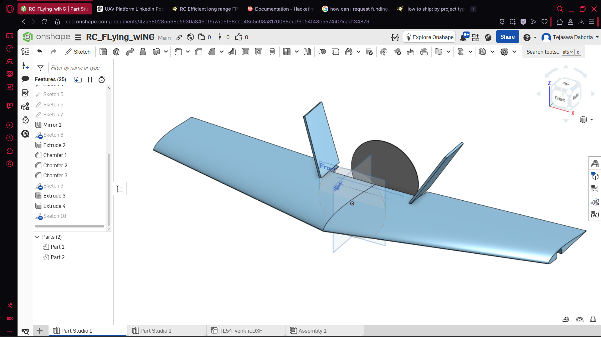
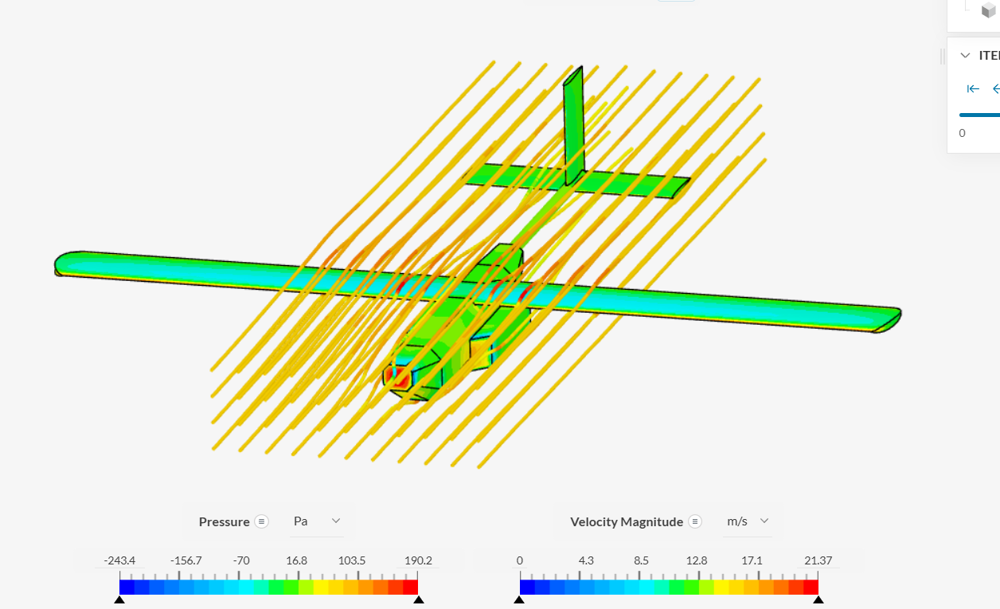
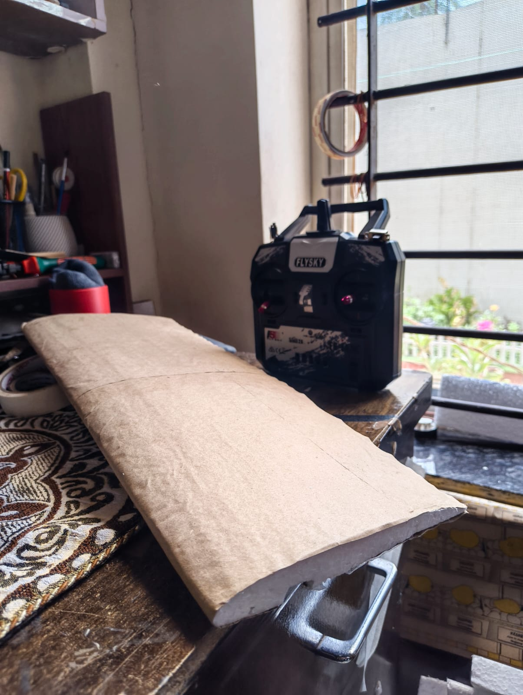

# Project Journal

## June 15, 2026

* Thought of a sub 500g flying wing aircraft for this job
* Selected fixed-wing configuration for its excellent performance.
* thought about the bay dropping idea and researched upon it to how to achive it using a flightcomputer
* Evaluated multiple airfoils and wing geometries.
* Calculated wing loading and estimated flight performance for the flying wing.
Time: 3 hours

## June 16, 2026

* Changed the whole design into a 2m wingspan large UAV aircraft to maximise stablity
* Decided upon the battery pack
* Thought of using 1 5010 bldc for the propulsion system
* picked SD7037 airfoil for its efficient long range UAV characterstics and low reynolds number providing excellent lift and stablity
* learned to setup CFD sims and ran multiple on the airframe to test its capablities
* Found the respective electronics that i would need to make this project possible and made a BOM, turns out i am going overbudget to 200 dollars
* Canged to cheaper 2 A2212 BLDC motors with 10 inch props and removed telemetry as its not that necessary, finally was able to get the plane underbudget also gave up on using a carbon spar for wing and instead i using a wooden spar
* Did some math to figure out flight times, would need to make it in real life to map out how long can it actually go to
* installed mission planner to get a fell of things, turns out this is a bit complex

Time: 5 hours

## June 17, 2026

* Made some more tiny changes in the BOM trying to get even more underbudget
* Cut out an SD7037 airfoil out of thermocol to test outside in my dads car to get some data to plot into mission planner about the stall characterstics
* learned mission planner and was fianlly able to plan my first mission and i ran it in a simulator and it worked as intended
* Made the control horn, motor mount and templates for wing and fuselage rib profiles
* Cleaned up the github repo and added my sacred build process to the Readme
* Cleaned up the BOM and finalised the part list.
* Went over everything again to get everything ready for submission
* Made the JOURNAL.md file

Time: 5 hours

## Total Time

13 hours
