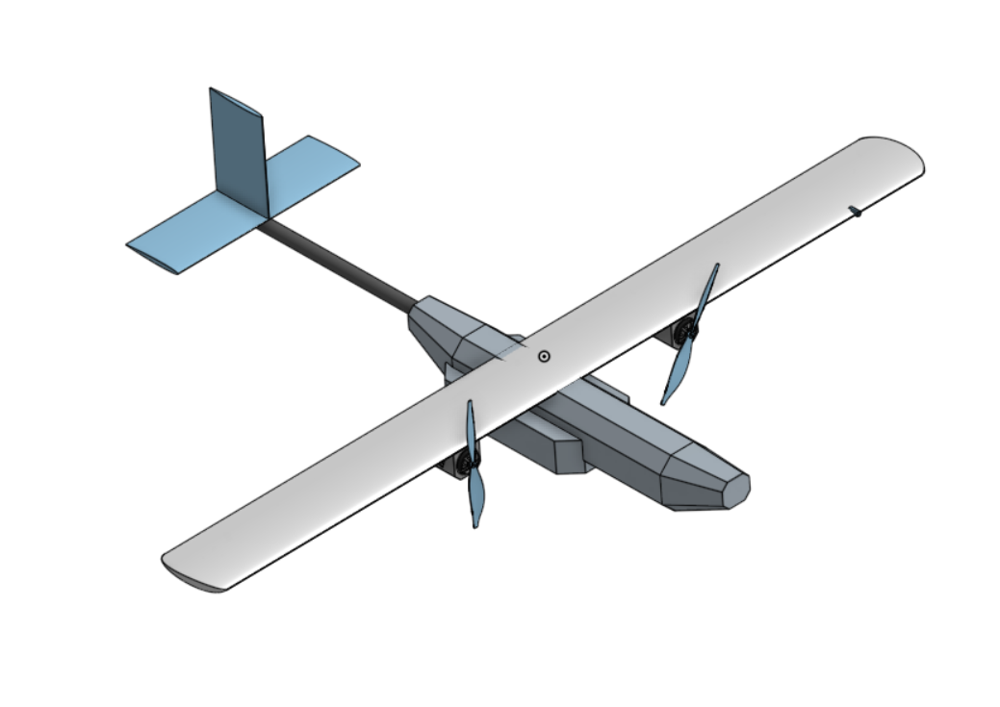

# Long Range Endurance UAV

This is a long-endurance autonomous fixed-wing UAV designed for lightweight package delivery and remote logistics missions.

The project focuses on creating a low-cost, energy-efficient and open source aircraft capable of autonomous waypoint navigation, payload deployment, and extended flight durations using commercially available components and a custom-built airframe.

## Design Preview

### Airframe Concept

### CFD simulations at 50kmph

## Key Features

* Autonomous flight using ArduPilot
* Pixhawk-based navigation and control
* Long-endurance Li-ion power system
* Lightweight foam-composite airframe
* Twin-motor propulsion system
* Payload delivery mechanism
* Modular and repairable design

## Hardware

### Flight Control

* Pixhawk 2.4.8
* uBlox Neo M8N GPS + Compass

### Propulsion

* 2× A2212 1000KV Brushless Motors
* 2× 30A ESCs
* 10×4.5 Propellers

### Power System

* 4S4P (or more) 18650 Li-ion Battery Pack

## Status

Currently the deisgn is being worked upon by me, the build process for it will be out soon aswell along with the respective 3d printable templates, im also testing different airfoils by cutting them out of thermocol and looking at their characterstics at different speeds while sitting in a car and them out the window.

Future updates will include:

* Airframe construction
* Flight testing
* Autonomous navigation validation
* Payload delivery demonstrations
* Performance analysis
